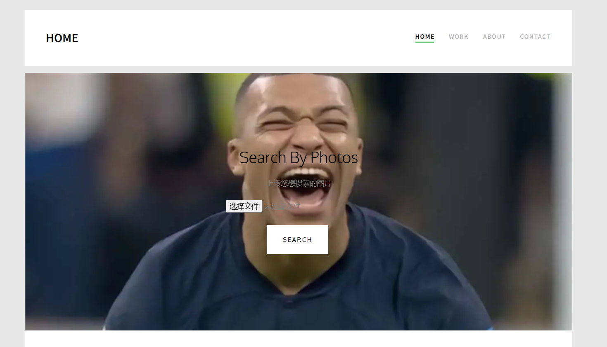
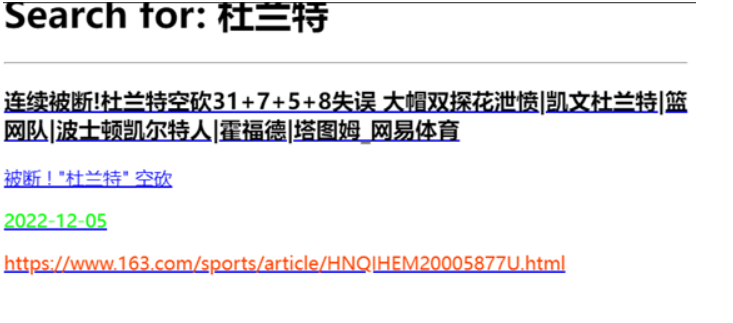
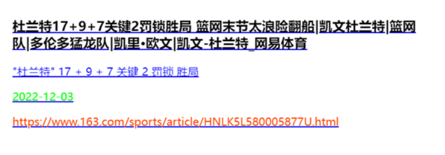
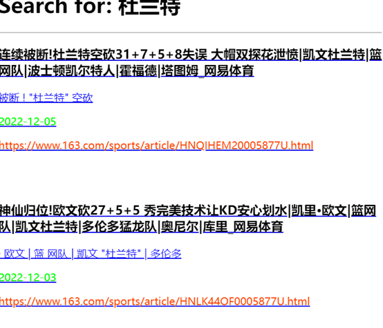
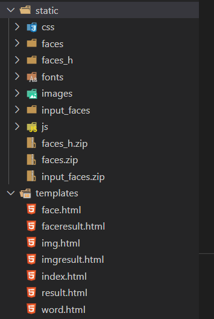

<font size=6 ><center>**电类工程导论（C类）大作业报告**</center></font>
<font size=5 ><center>**2022-2023 Fall EE208 Group12**</center></font>
<font size=4 ><center>李昊 叶博文 罗新浩 刘易洲</center></front>
<br>
<br>
<br>
<br>
<br>
<font size=3 ><center>2023 年 1 月 15 日</center></front>
<div STYLE="page-break-after: always;"></div> 

<font size=5 ><center>**体育新闻信息抽取、索引和检索及搜索引擎搭建**</center></font>
<font size=3 ><center>**摘要**</center></font>
&emsp;在本次项目中，我们先利用并行式爬虫爬取1w余体育网页和网页中对应的大量图像。然后对这些新闻数据进行解析，并建立索引。在搜索引擎的创立过程中，我们利用lucene进行关键词查询，并实现了按相关度和时间排序；利用通过ResNet50模型提取图像特征信息，并基于LSH算法进行图片及人脸搜索。整个网页采用Flask库进行搭建，并借助bootstrap框架优化页面设计。

&emsp;bonus:实现了基于Levenshtein的新闻聚类;实现了人脸识别。
<div STYLE="page-break-after: always;"></div>

<font size=5 ><center>**目录**</center></font>

- [1 所需要的库和环境](#1-所需要的库和环境)
- [2 爬取网页收集原始数据](#2-爬取网页收集原始数据)
    - [2.1 思路及流程描述](#21-思路及流程描述)
    - [2.2 细节与优势](#22-细节与优势)
    - [2.3 遇到的困难](#23-遇到的困难)
- [3 新闻索引的创建及基于关键词按相关度排序](#3-新闻索引的创建及基于关键词按相关度排序)
    - [3.1 基本思路](#31-基本思路)
    - [3.2 核心代码](#32-核心代码)
    - [3.3 遇到的困难](#33-遇到的困难)
- [4 基于关键词搜索按时间排序](#4-基于关键词搜索按时间排序)
    - [4.1 爬取时间](#41-爬取时间)
    - [4.2 时间模式](#42-时间模式)
    - [4.3 时间排序](#43-时间排序)
- [5 利用LSH的以图搜图](#5-利用lsh的以图搜图)
    - [5.1 基本思路](#51-基本思路)
    - [5.2 图片提交](#52-图片提交)
    - [5.3 LSH搜索](#53-lsh搜索)
    - [5.4 结果渲染](#54-结果渲染)
- [6 相似新闻的自动聚类(bonus)](#6-相似新闻的自动聚类bonus)
    - [6.1 主要思路](#61-主要思路)
    - [6.2 代码实现思路](#62-代码实现思路)
    - [6.3 核心代码](#63-核心代码)
- [7 前端框架设计](#7-前端框架设计)
    - [7.1 网页框架](#71-网页框架)
    - [7.2 网页设计思路](#72-网页设计思路)
    - [7.3 实现的效果](#73-实现的效果)
    - [7.4 网页搭建过程中遇到的困难及解决方案](#74-网页搭建过程中遇到的困难及解决方案)
    - [7.5 核心代码文件展示](#75-核心代码文件展示)
- [8 人脸识别部分(bonus)](#8-人脸识别部分bonus)
    - [8.1 环境准备](#81-环境准备)
    - [8.2 建立人脸图片库](#82-建立人脸图片库)
    - [8.3 图片特征信息](#83-图片特征信息)
    - [8.4 前后端交互](#84-前后端交互)
    - [8.4 核心代码](#84-核心代码)
- [9 效果展示](#9-效果展示)

<div STYLE="page-break-after: always;"></div> 

### 1 所需要的库和环境
- openCV NumPy Matplotlib jieba Flask dlib 
- Docker配置的sjtucmic/ee208镜像环境

### 2 爬取网页收集原始数据
##### 2.1 思路及流程描述 
&emsp;爬取对象：体育类新闻
&emsp;基本流程：与平时作业的实验中的爬虫部分大致相同，采用多线程进行爬取，每一个线程每一次的爬取流程如下：
1. 从待爬取队列中弹出第一个网页。
2. 寻找该网页是否在已爬取列表中，如果已爬取，则直接结束流程。如果未爬取，则继续进行。
3. 查找网页类型是否为所需的新闻类型，如果是，爬取该新闻网页的标题、网址链接、发布日期与正文内容，将相关内容写入txt文件中。同时，爬取图片链接与图片的描述文字信息，由于一个网页可能有许多张图片，因此将图片-描述信息以表格的形式写入用于储存图片的txt文件中，用于图像索引的使用。
4. 查找当前网页中的所有超链接，如果域名符合爬取时的要求（如爬取网易的体育新闻时，为了不使搜索范围发生偏移， 'sports.163.com' 或'www.163.com/sports'），将链接网址加入队列中待爬取。
5. 在已爬取列表中添加当前网页，并将已爬去网页的计数器加一，结束爬取进程。
##### 2.2 细节与优势
&emsp;在选取新闻类型时，由于本搜索引擎定位为体育类新闻的搜索引擎，为了精准搜索，将网址对象局限为体育网站中的“article”类文章。对于爬取对象，综合考虑了网页新闻的质量、网页结构的清晰性，选择了新浪体育与网易体育中的体育类新闻，共爬取有效信息10000余条。
&emsp;在爬取网页的文字信息时，常规方法为texts = soup.findAll(text=True)，然而，经过观察，使用该方法爬取到的网页内容容易存在较大量的结构性内容（如代码），与正文关联并不大。在本实验中，所期望获取的是新闻中段落里的文字内容，因此，经过对网页的具体分析，本实验将爬取的文字信息局限为'p','h1','strong'
&emsp;在获取图片的描述信息时，优先寻找图片本身的tag中是否有所描述（alt参数），如果没有，则不断查找该结点的父亲结点中是否含有文字信息。
&emsp;若出现以下异常中的任何一项，则认为该网页并不符合要求：没有标题；没有时间信息。
&emsp;在写入txt时，较为一般的做法是将网页内容写入html文件夹下的txt文件中，随后从index.txt中寻找网页网址与内容文件的匹配，然而，本程序直接在html文件夹下的文件中写入网址（通过将网址写在第一行）。在建立索引的过程中，仅需遍历html文件夹中的所有文件即可（随后用readline()读取网址），无需再查看index.txt，省下了不必要的多余操作。
##### 2.3 遇到的困难
1. 网易体育与新浪体育网页上显示信息的html文本结构并不相同，如日期的现实，新浪体育需从网址中提取，而网易体育则需要从文章代码标签中提取，图片描述等信息的提取方式均不同，需要根据实际情况进行分析。
2. 爬取10000余条网页时，实际爬虫所浏览过的网页远超10000条（因为大部分网页均不是文章，但本实验需要这些网页的超链接信息进行搜索），是一项量很大的任务，在采取多线程解决时，如线程较多，又会出现不同线程间上锁与解锁的卡顿。因此，应合理设置多线程的个数。（或采用优化的算法）

### 3 新闻索引的创建及基于关键词按相关度排序
##### 3.1 基本思路
&emsp;创建索引的过程和之前的lab类似，对已经crawl得到的内容进行提取所需（分别按照t1，t2），并对提取出来的内容进行jieba中文分词。
其中为了实现搜索时会出现与内容相应匹配的图片，特意增加了img。由于每条网址中具有代表性的匹配图片被crawl出来的位置不同，所以增加a == 6 or a == 7，并增加数量N来基于新闻网页的种类进行提取。
##### 3.2 核心代码
```python
def indexDocs(self, root1, root2, writer):

    t1 = FieldType()
    t1.setStored(True)
    t1.setTokenized(False)
    t1.setIndexOptions(IndexOptions.NONE)  
    
    t2 = FieldType()
    t2.setStored(False)
    t2.setTokenized(True)
    t2.setIndexOptions(IndexOptions.DOCS_AND_FREQS_AND_POSITIONS) 
    
    for root1, dirnames, filenames in os.walk(root1):
        N = 0
        for filename in filenames:

            print("adding", filename)
            try:
```
```python
                path1 = os.path.join(root1, filename)
                path2 = os.path.join(root2, filename)
                file1 = open(path1, encoding='utf8')
                file2 = open(path2, encoding='utf8')
                url = ''
                date = ''
                title = ''
                contents = ''
                for line in file1.readlines():
                    if(url == ''):
                        url = line
                        continue
                    if(title == ''):
                        title = line
                        continue
                    if(date == ''):
                        date = line
                        continue
                    if(contents == ''):
                        contents = line
                        continue
                a = 0
                for line in file2.readlines():
                    a += 1
                    if(a == 6 and N > 5013):
                        img = line[0:line.index('\t')]
                        break 
                    if(a == 7 and N <= 5013):
                        img = line[0:line.index('\t')]
                        break
                contents = ' '.join(jieba.cut(contents))
                file1.close()
                doc = Document()
                doc.add(Field("name", filename, t1))
                doc.add(Field("path", path1, t1))
                doc.add(Field("url",url,t1))
                doc.add(Field("date",date,t1))
                doc.add(Field("title",title,t1))
                doc.add(Field("img",img,t1))
                if len(contents) > 0:

                    doc.add(Field("contents", contents, t2))
                else:
                    print("warning: no content in %s" % filename)
                writer.addDocument(doc)
            except Exception as e:
                print("Failed in indexDocs:", e)
            N += 1
```
##### 3.3 遇到的困难
1. 由于网站是从不同的体育网站爬取来的，所以与内容对应的匹配图片所在位置不同，在增加img项的时候会导致如果在同一位置得到图片会不匹配，因此在之后我们通过增加判断来解决这个问题。
2. 初始时并未有空的判断，即有些新闻网站并没有date或者title，所以在app运行的时候会出现报错，后续增加判断之后将没有问题了。
### 4 基于关键词搜索按时间排序
##### 4.1 爬取时间
&emsp;利用爬虫进行网站爬取时，特地关注网站发布日期。通过观察网页结构，搜索标签```meta```，可以获得网页发布的时间信息。具体代码如下：
```python
for i in soup.findAll('meta'):
	if i.get('property','') =='article:published_time':
		t = i.get('content','')[0:10] #新闻时间
		break
    else:
        t = find_date(page)
```
&emsp;同时，由于新浪新闻的特殊性，其时间信息存储在网址的字符串中，需要单独编码考虑
```python
def find_date(page): #从网址字符串中找到日期（仅在新浪体育的搜索中匹配）
    for i in range(len(page)-5):
        if page[i]=='-':
            if page[i+3]=='-':
                try:
                    a,b,c = int(page[i4:i]),int(page[i+1:i+3]),int(page[i+4:i+6])
                    return page[i-4:i+6]
                except BaseException:
                    return ''
```
##### 4.2 时间模式
&emsp;在bio_form.html中添加type为radio，名字分别为mode1，mode2，对应键值为score和time的两个单选框，作为判断以何种形式排序的依据。
```html
<form action="result">
	<label>Keyword</label>
	<input type="text" name="keyword"><br>
	<input type="radio" name="mode1" value = 'score' checked/>score
	<input type="radio" name="mode2" value = 'time'/>time
	<input type="submit" name="Search">
</form>
```
&emsp;在```def bio_data_form()```中，获取两个模式的信息，并传入到```result()```函数中，在里面判断，如果mode2被选中，则将mode设定为time传入到最后的搜索函数中
```python
mode1 = request.args.get('mode1')
mode2 = request.args.get('mode2')
mode = None
if mode2 == 'time':
	mode = mode2
else:
	mode = mode1
```
##### 4.3 时间排序
&emsp;首先，定义时间比较大小的函数```timeCompare(time1, time2)```，其中time1和time2都是以格式xxxx-xx-xx（年月日）的形式传入。返回值中1代表time1晚于time2，0则反之。具体代码如下：
```python
def timeCompare(time1, time2): # 1 -> time1 >= time2; 0 -> times2 > time1
    time1 = time1.split('-')
    time2 = time2.split('-')
    for i in range(len(time1)):
        if int(time1[i]) > int(time2[i]):
            return 1
        elif int(time1[i]) < int(time2[i]):
            return 0
        else:
            continue
    return 1
```
&emsp;在```runs(searcher, analyzer,command, mode)```函数中，如果传入的模式mode为time，则对自己检索好的结果进行时间的排序，对结果排序好之后，再进行结果输出。由于原先搜索结果是按相关度进行排序，采用冒泡排序算法，在时间按新到旧的同时，相关度的相对顺序并未改变，从而做到了有一定逻辑性。具体排序代码如下：
```python
if mode == "time":
            for i in range(len(urlst)):
                for j in range(len(urlst)-1-i):
                    if timeCompare(timlst[j], timlst[j+1]) == 0:
                        titlst[j], titlst[j+1] = titlst[j+1], titlst[j]
                        timlst[j], timlst[j+1] = timlst[j+1], timlst[j]
                        urlst[j], urlst[j+1] = urlst[j+1], urlst[j]
                        contentlist[j], contentlist[j+1] = contentlist[j+1], contentlist[j]
```
&emsp;同时，考虑到有时既需要时间排序，又需要相关度排序。以用户体验角度思考，不可能再次输入关键字，选择所需要的模式进行查找。为了方便实用，考虑仅需要更改模式，不需要重新输入关键字直接搜索，即可对上一个关键字再次进行检索。
大致思想便是存储上一轮搜索所输入的关键字信息，设定变量```last_search```如果本轮关键字获取为空，则认为```keyword```应为```last_search```，反之，则将```keyword```赋值为```last_search```。具体代码如下：
```python
keyword = request.args.get('keyword')
if keyword == '':
	keyword = last_search
elif keyword != '':
	last_search = keyword
keyword = ' '.join(jieba.cut(keyword))
```
### 5 利用LSH的以图搜图
##### 5.1 基本思路
&emsp;整个以图搜图的基础思路是利用lab14中提供的LSH分类搜索方法进行图片的检索；前端的网页渲染是基于Flask进行编写。后面将分为后端及前端分别进行介绍。
##### 5.2 图片提交
&emsp;与文字检索不同，如何将图片进行上传，以及上传的形式如何都是该任务需要思索的问题。本次任务中，采用```<input id="file" name="file" type="file"/>```进行文件的选取，这样提交后的图片是以地址的方式传入到表单中进行后续的操作。具体代码如下：
```html
<p>上传您想要搜索的图片</p>
<form class="form-inline" method="POST" action='/imgresult' enctype="multipart/form-data">
    <input id="file" type="file" name="file" accept=".jpg,.png"><br/>
    <button type="submit" class="btn btn-primary btn-learn" >Search</button>
</form>
```
&emsp;提交渲染后的效果如图所示：


&emsp;此时，注意到由于网页中有两种不同的搜索方式，对应提交不同的内容，如何正确的将内容渲染到对应的网页中是另外一个亟待解决的问题。本次大作业中，由于文字检索中需要传回关键字作为搜索对象，而图片则需上传本地图片文件，故以此为突破口，分别渲染两种网页进行不同的搜索：
```python
@app.route('/wdresult', methods=['GET','POST'])
def wd_result():
    keyword=request.args.get('keyword')
    res_cnt,res_list=search(keyword)
    res_cnt_1,res_list_1=search_by_time(keyword)
    return render_template("result.html", keyword=keyword,res_cnt=res_cnt,res_list=res_list,res_cnt_1=res_cnt_1,res_list_1=res_list_1)

@app.route('/imgresult', methods=['GET','POST'])
def img_result():
   pic = request.files['file'] # 得到照片的url
   vm.attachCurrentThread()

   start = str(pic).index("'") + 1
   l = str(pic)[str(pic).index("'")+1:].index("'")
   pic = str(pic)[start:start + l]
   searchResult = queryPicture(pic)
   print(searchResult)
   length = len(searchResult)
   return render_template('imgresult.html', res_list = searchResult, res_cnt = length)
```
&emsp;最后，在app.py中进行LSH搜索，回传结果，将结果在imgresult.html中进行渲染，具体代码如下：
```python
def queryPicture(picture): # picture is an array
    def get_picture(picture):
        cap = cv2.VideoCapture(picture)
        ret,img = cap.read()
        return img
    
    def get_color(img1):
        img = np.array(img1)
        feature = []
        sum = img.sum()
        for i in range(3):
            uni_img = img[:, :, i]
            img_color = uni_img.sum()
            feature.append(img_color/sum)
        return feature
   
    def distribution(feature):
        distribute = []
        for i in feature:
            if i >= 0 and i < 0.3:
                distribute.append(0)
            elif i >= 0.3 and i < 0.36:
                distribute.append(1)
            elif i >= 0.36:
                distribute.append(2)
        return distribute
   
    def extract(img):
        H = img.shape[0]
        W = img.shape[1]
        midH = H // 2
        midW = W // 2
        feature = []
        img1 = img[0:midH, 0:midW, :]
        img2 = img[0:midH, midW:, :]
        img3 = img[midH:, 0:midW, :]
        img4 = img[midH:, midW:, :]
        img_set = [img1, img2, img3, img4]
        for uni_img in img_set:
            feature += get_color(uni_img)
        feature = distribution(feature)
        return np.array(feature)
```
```python   
    def Unary(c, num):
        ham1 = [1 for i in range(num)]
        ham2 = [0 for i in range(c - num)]
        ham = ham1+ham2
        return ham

    def LSH(feature):
        C = 4
        g = [1, 3, 7, 8, 13, 16, 18, 21, 23, 27, 33, 34, 39, 45, 48]
        unary = []
        for i in feature:
            unary += Unary(C, i)
        gp = [unary[i-1] for i in g]
        return np.array(gp)

    def get_path(gp):
        path = ''
        for i in gp:
            path += str(i)
        return path
    
    img = get_picture(picture)
    target_feature = extract(img)
    gp = LSH(extract(img)) # 0, 1, 2
    root = get_path(gp)
    root1 = "LSH_data/" + root
    matched = []
    for root2, dir, file in os.walk(root1, topdown=False):
        for name in file:
            img = cv2.imread(os.path.join(root2, name), cv2.IMREAD_COLOR)
            feature = extract(img)
            dis = np.linalg.norm(feature - target_feature)
            if dis <= 1:
                matched.append("../static/images/LSH_data/{}/{}".format(root, name))
    
    return matched
```
##### 5.3 LSH搜索
&emsp;首先，将以url形式存储的图片进行LSH分类，由于具体思路与lab14中大致一致，在此便不再赘述。具体讲一点问题，便是如何将以url形式传入的图片转换为可以操作的RGB三通道tenser：利用openCV中```cv2.VideoCapture()```函数，可以定位下载url中的图片，并以RGB三通道的tenser进行表示，具体转换代码如下：
```python
def queryPicture(picture): # picture is an array
    def get_picture(picture):
        cap = cv2.VideoCapture(picture)
        ret,img = cap.read()
        return img
```
&emsp;LSH分类完成后的结果如下图所示，并存储在名为static文件夹下imges文件夹的LSH_data中：


##### 5.4 结果渲染
&emsp;将匹配好的图像在分类后的地址以list形式回传到picture函数中，将其参数穿入到picture.html中进行结果渲染。实现思路较为简单，即利用img标签对图片结果进行输出，src中存储list中匹配结果的地址，具体代码如下：
```html

	<div class="col-md-4 text-center animate-box">
	    <a href="res_list[i]" class="work" style="background-image: url({{res_list[i]}});"></a>
	</div>

```
搜索结果展示：


### 6 相似新闻的自动聚类(bonus)
##### 6.1 主要思路
&emsp;关于自动聚类，只需要将搜索得到的结果进行按照相似度聚集即可，所以在app里面先进行关键词搜索，然后将搜索结果按照相似度进行聚类，比如一定是前四条互相相似度最高（其中第一条一定是和输入关键字匹配度最高的搜索结果），中间四条相似，后几条相似。（类似这样的聚类）。
##### 6.2 代码实现思路
&emsp;主要基于Levenshtein.ratio。即计算莱文斯坦比：
<font size=4 ><center>$r = \dfrac{sum-ldist}{sum}$</center></front>
&emsp;其中sum是指str1和str2字串的长度总和，ldist是类编辑距离。注意这里是类编辑距离，在类编辑距离中删除、插入依然+1，但是替换+2。
&emsp;计算Jaro距离,两个给定字符串S1和S2的Jaro距离为：
<font size=4 ><center>$$ d_j=\begin{cases} 
0 & m = 0 \\
\frac{1}{3}(\frac{m}{[s_1]}+\frac{m}{[s_2]}+\frac{m-t}{m}) & otherwise \\ 
\end{cases}$$</center></front>
&emsp;其中m为s1，s2匹配的字符数，t是换位的数目。两个分别来自S1和S2的字符如果相距不超过[$\frac{max([s_1],[s_2])}{2}-1$]时，我们就认为这两个字符串是匹配的；而这些相互匹配的字符则决定了换位的数目t，简单来说就是不同顺序的匹配字符的数目的一半即为换位的数目t。举例来说，MARTHA与MARHTA的字符都是匹配的，但是这些匹配的字符串中，T和H要换位才能把MARTHA变为MARHTA，那么T和H就是不同的顺序的匹配字符，$t=\frac{2}{2}=1$。
&emsp;得到距离最近的一个作为最相似的，然后依次进行得到一组相似的结果。
&emsp;Ps：而本次实验实现的自动聚类是在未进行时间排序的时候聚类。（我们组实现的搜索可以达到只按照相似度搜索之后把搜索结果自动聚类，再手动按照时间排序）所以，本次实验得到的结果按时间排序优先级是在自动聚类之上的。
&emsp;下面是效果对比：（为了效果明显，使用的是半成品的效果对比，完成的大作业已经实现了自动聚类）
&emsp;没有进行自动聚类：


&emsp;进行了自动聚类：

&emsp;我们可以看到，第一条是相同的，而没有进行自动聚类之前，第二条是和我的输入“杜兰特”第二匹配的搜索结果，而进行了聚类之后，第二条变成了和输入“杜兰特”较为相似的结果里面，和第一条相似度最高的结果。这就是我们所实现的自动聚类效果。

##### 6.3 核心代码
```python
def simility(res_list):
    simility = []
    length = len(res_list)
    length1 = length
    pos = 1
    while(pos < length1):
        length = length1
        while(length > pos):
            simility.append(Levenshtein.ratio(res_list[pos - 1]['title'],res_list[length - 1]['title']))
            length -= 1
        length = length1
        while(length > pos):
            maxq = simility.index(max(simility))
            if(simility[maxq] >= 0.4):
                simility[maxq] = 0
                res_list[pos]['title'], res_list[maxq]['title'] = res_list[maxq]['title'], res_list[pos]['title']
                res_list[pos]['date'], res_list[maxq]['date'] = res_list[maxq]['date'], res_list[pos]['date']
                res_list[pos]['url'], res_list[maxq]['url'] = res_list[maxq]['url'], res_list[pos]['url']
                res_list[pos]['contents'], res_list[maxq]['contents'] = res_list[maxq]['contents'], res_list[pos]['contents']
                res_list[pos]['img'], res_list[maxq]['img'] = res_list[maxq]['img'], res_list[pos]['img']
                pos += 1
            else:
                break
            length -= 1
        pos += 1
    return res_list
```

### 7 前端框架设计

&emsp;此次搜索引擎前端框架基于Flask进行搭建，主要文件结构为：
- static
  - css
  - fonts
  - js
  - images
  - faces
  - input_faces
  - faces_h
- templates
- app.py
&emsp;其中static文件夹用来存放包括css、js和图片在内的用来渲染网页的静态文件，templates文件夹下存放html模板。
##### 7.1 网页框架
&emsp;大体框架采用网上搜集并重新搭配组合的模板，为了优化网页排版，本次实验选用[bootstrap](https://www.bootcss.com/)作为网页搭建框架，并在csdn、php中文网等网站搜集了好看的网页模板。
&emsp;其中构建的主要网页包括：主页、基于关键词的搜索页面、基于图片的搜索页面。网页的具体演示可以观看demo视频。
##### 7.2 网页设计思路
&emsp;基于关键字进行搜索：在前端输入文字后,将其传入后端。并用parseCommand处理输入的文字信息。用163_index内存储的索引初始化analyser和searcher对象。并调用searchr寻找相关新闻，并将结果返回给前端。此外，基于date索引，用timeCompare对结果依据时间排序。
&emsp;图像类及人脸搜索：在前端输入图片后，将其保存在本地，并在后端用requests请求得到照片的url（相对路径）。app.py调用queryPicture或face_search函数提取目标图片的特征信息，并利用LSH进行搜索，并将相似图片的路径返回给前端。
&emsp;在实现前后端交互时，我们主要使用form表单来从前端获取信息并传递给后端。并在不同的html模板中，给form不同的name属性。
##### 7.3 实现的效果
- 基本的关键词搜索并展示基于相关度和时间的排序结果
- 基本的图片搜索及展示
- 展示搜索聚类的结果
- 展示人脸搜索的结果
- 动态显示特效
- 鼠标悬浮特效：当鼠标停留在新闻图片上时，会出现悬浮框显示新闻的标题，点击即可跳转如新闻报道页面。
##### 7.4 网页搭建过程中遇到的困难及解决方案
&emsp;起初并没有弄清楚静态资源的载入问题，网页无法加载静态js和css资源。解决此问题，我们需要将static文件夹加入到网页的静态资源路径中。具体操作上是在app.py中添加app=Flask(__,static_url_path=/static′)。
&emsp;在图片搜索中，遇到的困难主要是前后端交互的过程，详细学习了html+css后，修改input输入框的类型为file，并调整表单发送属性为multipart/form-data即可上传本地图片，并在传入后端的过程中用requests请求得到了图片的相对路径。
&emsp;最后在显示搜索图片结果的时候，在html中采用img src标签，遇到了图片无法展示的问题。在查询相关博客文章后，发现主要是由于图片路径问题，因此将显示图片的前端搭建改为：
```html
<a href="res_list[i]" class="work" style="background-image: url({{res_list[i]}});"></a>
```
&emsp;采用css语言style="background-image: url()"，并将路径传输进去，完成相对路径与绝对路径的转换后，成功显示出了结果图片。
##### 7.5 核心代码文件展示


### 8 人脸识别部分(bonus)
##### 8.1 环境准备
&emsp;在网上查询相关资料后，该部分的实现我们依赖了dlib库。并参考相关资料引用了部分内容完成extract_faces.py文件。Dlib库是一个包含了机器学习算法的C++开源工具包，但使用C++编写。因此我们并不能直接通过pip安装，而需要先pip预安装Cmake和boost库。
##### 8.2 建立人脸图片库
&emsp;建立人脸图片库的源代码被封装在extract_faces.py文件下。对于目录static/faces下每张图片，调用dlib库下的get_frontal_face_detecto()函数，截取其人脸边框部分。并依据人脸边框的大小，新建一张空的图片并将人脸写入。
##### 8.3 图片特征信息
&emsp;该部分与以图搜图部分实现细节一致，在face_match函数里，通过extract得到图片中的人脸信息，依据相似度得到结果，并加入列表中传给后端显示出来。
##### 8.4 前后端交互
&emsp;该部分内容依然与以图搜图实现细节一致，通过face_result函数实现交互，并在对应的faceresult.html文件中进行效果渲染。
##### 8.4 核心代码
```python
import dlib
import numpy as np
import cv2
import os

class face_recognition(object):
    def __init__(self,path_read="static/faces/",path_save="static/faces_h/", 
    path_test_save="static/input_faces/",path_test="faces_input/"):
        '''
            @path_read:读取图像的路径
            @path_save:用来存储生成的单张人脸的路径
            @path_test:用来存储输入图像
            @path_test_save:用来存储输入图像的人脸
            @detector:dlib预测器
        '''
        self.path_read=path_read
        self.path_save=path_save
        self.path_test=path_test
        self.path_test_save=path_test_save
        self.detector=dlib.get_frontal_face_detector()
    
    # Delete old images
    def clear_images(self):
        imgs=os.listdir(self.path_save)
        for img in imgs:
            os.remove(self.path_save+img)
        print("finish",'\n')
    
    # extract the faces in test image
    def extract(self,filename):
        res=[]
        test_image=cv2.imread(self.path_test+filename)
        test_faces=self.detector(test_image,1)
        print(test_faces)
        for num,face in enumerate(test_faces):
            height,width= face.bottom()-face.top(),face.right()-face.left() # 计算矩形框大小
            test_img_blank=np.zeros((height, width,3),np.uint8) # 根据人脸大小生成空的图像
            for i in range(height):
                for j in range(width):
                    test_img_blank[i][j]=test_image[face.top()+i][face.left()+j]
            # save faces
            face_path=self.path_test_save+filename[:-4]+"%"+str(num+1)+".jpg"
            print("Save in:",face_path)
            cv2.imwrite(face_path,test_img_blank)
            res.append(face_path)
        return len(res),res

    # create the face database
    def face_recog(self):
        if not os.path.exists(self.path_save):
            os.mkdir(self.path_save)
        self.clear_images()
        read_imgs=os.listdir(self.path_read)
        for read_img in read_imgs:
            try:
                img=cv2.imread(self.path_read+read_img)
                faces=self.detector(img,1)
                print("num of faces:", len(faces), '\n')

                for num,face in enumerate(faces):
                    height,width= face.bottom()-face.top(),face.right()-face.left() # 计算矩形框大小
                    # 根据人脸大小生成空的图像
                    img_blank=np.zeros((height, width, 3), np.uint8)
                    for i in range(height):
                        for j in range(width):
                            img_blank[i][j] = img[face.top()+i][face.left()+j]
                    # save faces
                    print("Save into:",self.path_save+read_img[:-4]+"%"+str(num+1)+".jpg")
                    cv2.imwrite(self.path_save+read_img[:-4]+"%"+str(num+1)+".jpg",img_blank)
            except:
                continue

if __name__ == '__main__':
    face = face_recognition(path_read="static/faces/",path_save="static/faces_h/", 
    path_test_save="static/input_faces/",path_test="faces_input/")
    face.clear_images()
    face.face_recog()
```
### 9 效果展示
&emsp;由于创建索引的时候增加了img，所以在搜索时会有一张新闻里具有代表性的图片一同被展示出来，具体可以观看本组大作业中的demo演示视频及ppt。
